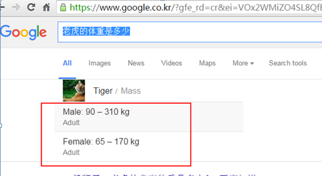

# DeepWebCrawler
1.GoogleKnowledge：谷歌知识爬虫，谷歌“知识图谱”（Knowledge Graph）——可以将搜索结果进行知识系统化，任何一个关键词都能获得完整的知识体系，先看看谷歌知识的搜索用法，例如我们可以查找老虎体重是多少；

_ _ _

如果想用程序取到这个结果，谷歌目前没有提供专门的API得到，直接抓取页面也没办法做到，因为这部分DOM结构是动态加载的，
谷歌知识爬虫(GoogleKnowledge.py)利用selenium调用chrome，可以查找到页面加载后的DOM结构，从而取到想要的结果；
关于selenium调用chrome的配置可以参考[http://blog.csdn.net/mmc2015/article/details/53064021](http://blog.csdn.net/mmc2015/article/details/53064021)。

